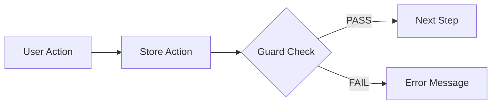

# SOP — Documentation Maintenance & Critical Flow Documentation

Standard Operating Procedure for keeping project documentation up-to-date as the codebase evolves.

---

## Overview

This SOP ensures that:
1. **Documentation stays in sync** with code changes (no stale docs)
2. **Critical flows are recorded** before implementation (clear intent)
3. **All team members** follow the same documentation process
4. **Future Claude sessions** have complete context (via memory + docs)

---

## Part 1: Documentation Update Trigger

### When to Update Documentation

Update docs **whenever you make changes to:**

| Change Type | Docs to Update | Urgency |
|---|---|---|
| **New feature** (modal, tab, page, flow) | CLAUDE.md, ARCHITECTURE.md, RULES.md, DOMAIN.md (if business logic) | HIGH |
| **New integration** (adapter, API) | ARCHITECTURE.md (Integration subsystems section) | HIGH |
| **New store action** or **guard logic** | ARCHITECTURE.md (State Transitions section), RULES.md (examples) | HIGH |
| **New journey phase** or **gate** | DOMAIN.md (Typical Order Flow section), ARCHITECTURE.md (State Transitions section) | HIGH |
| **Entity model change** (new field, new type) | ARCHITECTURE.md (Entity Models section), DOMAIN.md (if business impact) | MEDIUM |
| **Naming convention change** | RULES.md (Naming Conventions section) | MEDIUM |
| **Pattern change** (store pattern, form pattern, etc.) | RULES.md (relevant pattern section) | MEDIUM |
| **Bug fix** (especially escrow/gates) | ARCHITECTURE.md (if logic clarification needed) | LOW |
| **UI refactor** (no logic change) | CLAUDE.md (Directory structure only) | LOW |

### Example Scenarios

**Scenario 1: Add "Request Delay" feature**
- New journey phase? → Update DOMAIN.md + ARCHITECTURE.md
- New modal? → Update CLAUDE.md (directory), ARCHITECTURE.md (component hierarchy)
- New guard logic? → Update ARCHITECTURE.md (State Transitions)
- New escrow state? → Update DOMAIN.md + ARCHITECTURE.md + RULES.md (example)

**Scenario 2: Add new integration (e.g., real banking API)**
- New adapter file? → Update ARCHITECTURE.md (Integration Subsystems)
- New error handling? → Update RULES.md (Integration Patterns section)
- Breaking change to mock adapter? → Update AGENTS.md (Workflow definitions)

**Scenario 3: Fix escrow netting bug**
- Logic change? → Update ARCHITECTURE.md (Escrow Math section)
- No breaking change? → Update RULES.md (if clarification helps others avoid it)

---

## Part 2: Documentation Update Workflow

### Step 1: Identify What Changed

Before committing code, ask:
- **What did I add/change?** (feature, fix, refactor)
- **Does it affect the user's understanding?** (business logic, flow, patterns)
- **Which docs cover this area?** (see "When to Update" table above)

### Step 2: Update Relevant Docs

For each affected doc, follow this pattern:

#### CLAUDE.md
- **Update if:** Directory structure changed, new major pattern, new commands
- **Sections to edit:** Directory Structure, Key Patterns, Naming Conventions, Code Style, Known Caveats
- **Example:**
  ```markdown
  ✓ OLD: "src/integrations/ — mock adapters (HKIN, ICEGATE, WHL, logistics)"
  ✓ NEW: "src/integrations/ — mock adapters (HKIN, ICEGATE, WHL, logistics, BANKING_NEW)"
  ```

#### DOMAIN.md
- **Update if:** Business logic changed, new phase, new entity field, new payment mode, new trade rule
- **Sections to edit:** Three-Entity Model, Escrow Lifecycle, Per-Line Testing Modes, Journey Phases, Key Constraints
- **Example:**
  ```markdown
  ✓ OLD: "Journey gates enforce order (PAYMENT → TESTING → EXPORT → ...)"
  ✓ NEW: "Journey gates enforce order (PAYMENT → TESTING → DELAY → EXPORT → ...)"
  ```

#### ARCHITECTURE.md
- **Update if:** System design changed, new entity field, new integration, new selector, new gate logic, new component
- **Sections to edit:** Entity Models, Integration Subsystems, State Transitions & Guards, Component Hierarchy
- **Example:**
  ```markdown
  ✓ OLD: "interface OrderBundle { ... journey: JourneyStep[]; ... }"
  ✓ NEW: "interface OrderBundle { ... journey: JourneyStep[]; delays?: DelayRequest[]; ... }"
  ```

#### RULES.md
- **Update if:** Coding pattern changed, new guard pattern, new form pattern, new error handling
- **Sections to edit:** Zustand Store Patterns, React Patterns, DO List, DON'T List, Review Checklist
- **Example:**
  ```markdown
  ✓ ADD NEW PATTERN: "Delay Request Pattern" with code example
  ```

#### AGENTS.md
- **Update if:** New workflow definition needed, new agent use case, new testing scenario
- **Sections to edit:** Workflow Definitions, Real Workflow Examples, Tips for Effective Prompts
- **Example:**
  ```markdown
  ✓ ADD: "Workflow: delay-logic-audit — Verify all delay guards + expiry handling"
  ```

#### DOCUMENTATION.md
- **Update if:** Major changes to multiple docs (update the index)
- **Sections to edit:** Files Overview, Quick Reference (if task changed), Key Concepts Glossary
- **Example:**
  ```markdown
  ✓ OLD: "6 files" → ✓ NEW: "6 files (DELAY feature added)"
  ```

### Step 3: Review the Update

Before committing code, review:
1. **Docs match the code** — no inconsistencies
2. **Examples still work** — code snippets reflect actual code
3. **Cross-references valid** — links in docs point to correct sections
4. **Glossary updated** — any new terms added to DOCUMENTATION.md glossary

### Step 4: Commit (Code + Docs Together)

Commit code and docs **in the same commit**:

```bash
git add src/...  # code changes
git add *.md     # doc changes
git commit -m "feat: add delay feature

- New JourneyPhase DELAY between TESTING and EXPORT
- New store action requestDelay(orderId, days, reason)
- New DelayRequest type in src/types/index.ts
- New delay guard logic in gateReason()
- Updated DOMAIN.md: journey phases, escrow extension note
- Updated ARCHITECTURE.md: entity models, state transitions
- Updated RULES.md: new example for async action pattern
- Updated AGENTS.md: delay-logic-audit workflow"
```

---

## Part 3: Critical Flow Documentation

### What is a Critical Flow?

A **critical flow** is a **user journey or system behavior that:**
- Involves **multiple steps** across different components/stores
- Has **complex logic** (guards, gates, integrations)
- Is **financially sensitive** or **legally binding** (escrow, customs, masking)
- **Breaks easily** if logic is wrong (no margin for error)
- Affects **multiple personas** (SC, Finance, Approver)

### Examples of Critical Flows

✓ **Escrow Fund → Release → Refund** (financial)  
✓ **Order Creation from Supplier PO** (gating + allocation)  
✓ **Testing Confirmation → Escrow Release** (multi-gate, testing-dependent)  
✓ **Customs Filing → Relabel → Delivery** (compliance, sequencing)  
✓ **Extension Request → Approval → Escrow Extend** (async, manual approval)  
✓ **Masking Act (Relabel)** (core business logic)

### When to Document a Critical Flow

**Before writing code:**
1. Identify the flow (main user action → final outcome)
2. Break into steps (each step = a phase or gate or integration)
3. Document it (use template below)
4. Share with team (in docs/flows/ folder)
5. Get sign-off (SC/Finance/Approver as needed)
6. **Then implement**

**After code is complete:**
1. Update the flow doc if logic changed
2. Add it to ARCHITECTURE.md State Transitions section
3. Add E2E test steps (via AGENTS.md workflow or manual checklist)

---

## Part 4: Critical Flow Template

Create a new file for each critical flow: `docs/flows/{flow-name}.md`

```markdown
# Flow: {Flow Name}

**Status:** DRAFT / READY / IMPLEMENTED / DEPRECATED  
**Last Updated:** YYYY-MM-DD  
**Owner:** {Person/Team}  
**Personas:** {SC, Finance, Approver, Mgmt}

## Overview

{One paragraph: what this flow does, why it's critical, what it affects}

## Happy Path (Normal Case)

Step 1: {User action} → {Store action} → {Guard check} → {Outcome}  
Step 2: {Next action}  
...



## Edge Cases & Error Handling

| Case | Trigger | Behavior | Outcome |
|------|---------|----------|---------|
| {Scenario} | {What triggers it} | {How system responds} | {Result} |

## Related Entities & Fields

- **Entity 1:** Field A, Field B (modified in this flow)
- **Entity 2:** Field C (checked in guard)

## Guards & Conditions

```ts
{Guard logic or pseudocode}
```

## Integration Calls

| Adapter | Call | Input | Output | Error Handling |
|---------|------|-------|--------|---|
| {HKIN} | {fund} | {amount} | {escrowRef} | {rollback} |

## Selectors & Derived State

```ts
{Selectors that compute state for this flow}
```

## E2E Test Steps (Manual)

1. {Setup: reset demo, create order, etc.}
2. {Action: fund escrow, release, etc.}
3. {Verify: check state, integration log, UI}
4. {Assert: final outcome matches expected}

## Known Issues & Constraints

- {Issue 1}
- {Issue 2}

## Deprecated / Replaced By

If this flow was replaced: {Link to new flow}
```

### Example: Escrow Release Flow

```markdown
# Flow: Escrow Release (Tranche Payment to Supplier)

**Status:** IMPLEMENTED  
**Last Updated:** 2026-07-29  
**Owner:** Finance  
**Personas:** Finance (initiates), Approver (approves if T&Cs present)

## Overview

When goods are tested and confirmed PASS, the Finance team releases escrow funds to the supplier.
This flow is critical because it involves:
- Financial payment (material amount A1)
- Testing confirmation (PASS lot must exist)
- Terms validation (if T&Cs specified, they must be met)
- Cap enforcement (can't release more than A1 - refunded)
- Optimistic state management (release may fail mid-flight)

## Happy Path

Step 1: Finance views Order → EscrowTab  
Step 2: Finance clicks "Release Escrow" button (appears only when FUNDED + PASS lot exists)  
Step 3: Release modal opens, shows releasable cap = escrowRemaining  
Step 4: Finance confirms amount (default = cap) + clicks "Release"  
Step 5: Store action releaseEscrow(orderId, amount) called  
  - Guard: check escrowRemaining > 0, status == FUNDED, PASS lot exists  
  - Integration: hkinRelease(escrowRef, amount) called (async)  
  - State: RELEASE event added to escrow.events, status → PARTIALLY_RELEASED  
Step 6: HKIN response logged to integration log  
Step 7: UI updates to show released amount + new remaining cap  
Step 8: Success toast appears  

## Edge Cases

| Case | Trigger | Behavior |
|------|---------|----------|
| No PASS lot | User clicks Release before testing confirmed | Button disabled, tooltip "Test must PASS first" |
| Escrow not FUNDED | User clicks Release before payment sent | Button disabled, tooltip "Escrow not funded" |
| Concurrent release | Two users both click Release simultaneously | Second request gets "already released" guard block |
| HKIN API fails | Integration call fails (chaos toggle or real failure) | Optimistic state rolled back, error toast shown, user can retry |
| Partial release (e.g., 50% now, 50% later) | Finance releases 50% of cap | State shows new remaining = cap - released; can release again later |

## Guards & Conditions

```ts
// From src/store/selectors.ts
const canReleaseEscrow = (b: OrderBundle): string | null => {
  if (!b.escrow) return "No escrow on this order";
  if (b.escrow.status !== "FUNDED") return "Escrow not funded yet";
  if (escrowRemaining(b) <= 0) return "No funds remaining";
  if (b.escrow.status === "REFUNDED") return "Escrow already refunded (terminal)";
  
  // If T&Cs exist, require PASS lot
  if (b.termsConditions?.length > 0) {
    if (!b.lots.some(l => l.testStatus === "PASS")) {
      return "Per T&C, must have PASS lot before release";
    }
  } else {
    // If no T&Cs, check if testing is required
    const needsTesting = b.lines.some(l => l.testingMode !== "NONE");
    if (needsTesting && !b.lots.some(l => l.testStatus === "PASS")) {
      return "All testable lines must have PASS before release";
    }
  }
  
  return null; // can release
};
```

## Integration Calls

| Adapter | Call | Input | Output | Error Handling |
|---------|------|-------|--------|---|
| HKIN | hkinRelease | escrowRef, amount, currency | { txnId, released: true } | Rollback optimistic RELEASE event, retry available |

## Selectors

```ts
export const escrowReleased = (b: OrderBundle) =>
  (b.escrow?.events ?? []).filter((e) => e.type === "RELEASE").reduce((a, e) => a + e.amount, 0);

export const escrowRemaining = (b: OrderBundle) =>
  Math.max(0, (b.escrow?.materialAmount ?? 0) - escrowReleased(b) - escrowRefunded(b));
```

## E2E Test Steps (Manual)

1. Reset demo (↺ button)
2. Navigate to Orders, click "ORD-2026-00314" (HERO_ESCROW)
3. Go to Escrow tab, verify status = FUNDED, remaining = 7013
4. Go to Testing tab, click "Create WHL Sample" (for the ONE line that needs it)
5. Simulate WHL result: mark as PASS
6. Back to Escrow tab, "Release Escrow" button now appears (was disabled)
7. Click "Release Escrow", confirm amount = 7013 (the cap), click "Release"
8. Integration log shows HKIN release call with amount=7013
9. Escrow tab updates: status → PARTIALLY_RELEASED, released = 7013, remaining = 0
10. Success toast "Released ₹7013 to supplier"

## Known Issues

- (none currently)

## References

- DOMAIN.md: Escrow section
- ARCHITECTURE.md: Escrow Math, State Transitions
- RULES.md: Zustand Guard Patterns, Error Handling
```

---

## Part 5: Memory & Context Persistence

### Save to Project Memory

When you complete a critical flow or major feature, save it to the project memory system:

**Location:** `/Users/pushkarkumar/.claude/projects/-Users-pushkarkumar-Desktop-one-buy-projects-1data/memory/`

**File template:** `{feature-name}.md`

```markdown
---
name: {kebab-case-slug}
description: One-line summary of what was done
metadata:
  type: feedback / project / reference
---

# {Feature Name}

## Status
- IMPLEMENTED: {date}
- SHIPPED: {date}
- KNOWN ISSUES: {list}

## Files Modified
- src/store/store.ts: {what changed}
- src/types/index.ts: {what changed}
- src/integrations/{name}.ts: {new or changed}

## Key Decisions
- Decision 1: {what, why}
- Decision 2: {what, why}

## Testing Notes
- How to test: {steps}
- Edge cases: {list}

## Related Docs
- See DOMAIN.md section: {section}
- See ARCHITECTURE.md section: {section}
- See docs/flows/{flow-name}.md: {flow}

## Next / Future
- {future work}
```

**Example:**
```markdown
---
name: escrow-extend-feature
description: Request/approve escrow expiry extension with optimistic state + rollback
metadata:
  type: project
---

# Escrow Extend Feature (2026-07-28)

## Status
- IMPLEMENTED: 2026-07-28
- SHIPPED: 2026-07-29
- KNOWN ISSUES: none

## Files Modified
- src/types/index.ts: Added Escrow.extensions[], EscrowExtension type
- src/store/store.ts: Added requestEscrowExtension() action, hkinRequestExtension() integration
- src/integrations/escrow-hkin.ts: Added hkinRequestExtension() mock adapter
- src/components/order/modals.tsx: Added ExtendEscrowModal component
- src/components/order/order-workspace.tsx: Wired Extend button to modal

## Key Decisions
1. **Optimistic state push before async**: Improves UX (no lag), with rollback on failure
2. **Store-level pending guard**: Prevents duplicate requests while one is in-flight
3. **Netting logic unaffected**: Extension only updates expiryDate, not cap calculation
4. **Mock response**: APPROVED/DECLINED, with latency, logs to call log

## Testing Notes
- How to test: Reset demo → fund escrow → create PASS lot → Extend button appears → click → fill form → submit → check log
- Edge cases:
  1. Click Extend twice quickly → second blocked by pending guard
  2. HKIN fails → optimistic REQUESTED rolls back, user can retry
  3. Extend expires before delivery → relabel phase still proceeds (warning only)

## Related Docs
- See DOMAIN.md: Escrow Lifecycle & Extensions
- See ARCHITECTURE.md: Async Actions + Integration Calls
- See RULES.md: Async Action Pattern
- See docs/flows/escrow-extend.md: detailed flow

## Next / Future
- Real HKIN adapter integration (currently mock)
- Extend count limit (e.g., max 2 extensions)
- Extension approval workflow (Finance approves before HKIN call)
```

Then add a pointer to `MEMORY.md`:
```markdown
# Project Memory Index

## Features
- [Escrow Extend Feature](escrow_extend_feature.md) — Request/approve extension, optimistic state
- [Demo Flow](demo_flow.md) — End-to-end walkthrough of a complete order
```

---

## Part 6: Documentation Review Checklist

Every time you commit code with doc changes, verify:

- [ ] **Docs match code** — no inconsistencies or outdated examples
- [ ] **Cross-references work** — links in docs point to correct sections
- [ ] **Examples are accurate** — code snippets reflect actual implementation
- [ ] **New terms added to glossary** — if any new concepts introduced
- [ ] **All affected docs updated** — check "When to Update" table above
- [ ] **Commit message references docs** — mention which docs were updated
- [ ] **Critical flow documented** — if this is a major feature, file in docs/flows/
- [ ] **Memory saved** — if completing a feature, save to memory system
- [ ] **README still accurate** — if directory structure or commands changed

---

## Part 7: Documentation as Code (Future)

Once team grows, consider:

1. **DocString generation** — Auto-extract JSDoc → docs (TypeScript → Markdown)
2. **Schema sync** — Generate entity docs from TypeScript types
3. **Test-driven docs** — E2E tests generate flow docs
4. **Version tracking** — Git tags for each release + docs version
5. **Automated validation** — CI checks that docs match code (grep for removed functions, etc.)

---

## Quick Reference: Update Checklist by Feature Type

### Adding a New Modal
- [ ] CLAUDE.md: Directory structure (components/order/)
- [ ] ARCHITECTURE.md: Component hierarchy
- [ ] RULES.md: Modal pattern example (if new pattern)
- [ ] Commit message: mention modal addition

### Adding a New Integration
- [ ] ARCHITECTURE.md: Integration Subsystems section + code snippet
- [ ] RULES.md: Integration pattern example
- [ ] AGENTS.md: New workflow if testing is complex
- [ ] Commit message: mention new adapter

### Adding a New Journey Phase
- [ ] DOMAIN.md: Typical Order Flow section
- [ ] ARCHITECTURE.md: State Transitions section + entity model if new fields
- [ ] Create docs/flows/{phase-name}.md
- [ ] AGENTS.md: gate-logic-audit workflow mention
- [ ] Commit message: mention new phase + flow docs

### Adding a New Store Action
- [ ] ARCHITECTURE.md: Store Architecture section (if new pattern)
- [ ] RULES.md: Zustand pattern example (if new pattern)
- [ ] docs/flows/{flow-name}.md: Update relevant flow
- [ ] Commit message: mention action + which docs updated

### Fixing a Bug
- [ ] ARCHITECTURE.md: Clarify logic if it was confusing (prevents repeat)
- [ ] RULES.md: Add to DON'T list or pattern example (if common mistake)
- [ ] Commit message: mention bug fix + which docs clarified (if any)

---

## Support & Questions

**Q: How much do I need to document?**  
A: Document enough so that in 6 months, you (or a teammate) can understand WHY a decision was made without reading the code. Glossary + entity models + flow diagrams are usually enough.

**Q: What if docs and code conflict?**  
A: **Code is the source of truth.** Fix docs immediately (same commit). Never commit code without syncing docs.

**Q: How do I know if a change is "critical"?**  
A: If it involves escrow, gates, financial payment, compliance, masking, or multiple integration calls → it's critical. Document it.

**Q: Should I document bugfixes?**  
A: Only if the bug reveals a confusing pattern or design flaw. If it's a typo or one-liner fix, skip doc update.

**Q: Can I update docs without code?**  
A: Yes, if you're clarifying something that was unclear. Commit just the doc change with message: "docs: clarify {topic}".

